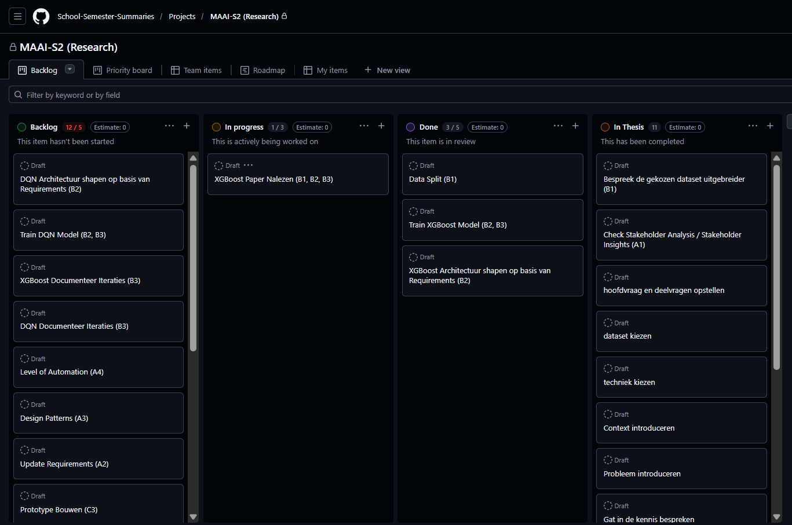

Niet persé een één op één planning gebruikt of aangehouden tot aan de 70% versie. Gewoon gefocussed op de deadlines. Zo heb ik het project in een paar delen verdeeld
- Onderzoeksplan
- Onderzoeksplan met feedback implementatie
- 70% versie
- 100% versie

Voor elk genoemde onderdeel heirboven zorg ik ervoor dat ik optijd begin zodat ik de deadlines haal. Als ik meer moet doen dan ik in mijn hoofd kan managen maak ik een klein overzicht in GitHub in de vorm van een tasklist en als het echt veel is evt. een kanban board.

Voor de 70% versie heb ik een kanban board gemaakt, aangezien er nog best wat moest gebeuren. Veel waarvan ik pas de laatste week ook van op de hoogte ben gesteld. Hier een screen capture van mijn board:

